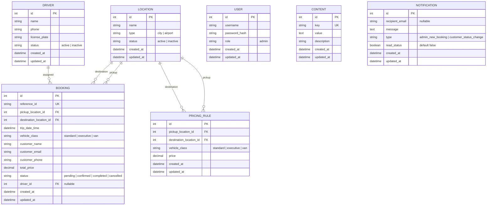

# Data Model: Airport Transfer and Driver Booking System

This document outlines the Sequelize database schemas and relationships for PostgreSQL.

## Entity Relationships (ERD Diagram)

---

## Model Specifications

### 1. Location Table (`locations`)
Stores active cities and airports.
- `id` (Integer, Primary Key, Auto-Increment)
- `name` (String, Not Null, Unique)
- `type` (Enum: `city`, `airport`, Not Null)
- `status` (Enum: `active`, `inactive`, Default: `active`)

### 2. Driver Table (`drivers`)
Stores driver profiles.
- `id` (Integer, Primary Key, Auto-Increment)
- `name` (String, Not Null)
- `phone` (String, Not Null)
- `license_plate` (String, Not Null, Unique)
- `status` (Enum: `active`, `inactive`, Default: `active`)

### 3. User Table (`users`)
Stores administrator accounts.
- `id` (Integer, Primary Key, Auto-Increment)
- `username` (String, Not Null, Unique)
- `password_hash` (String, Not Null)
- `role` (String, Not Null, Default: `admin`)

### 4. PricingRule Table (`pricing_rules`)
Defines the route-based flat rate prices.
- `id` (Integer, Primary Key, Auto-Increment)
- `pickup_location_id` (Integer, Foreign Key referencing `locations.id`, Not Null)
- `destination_location_id` (Integer, Foreign Key referencing `locations.id`, Not Null)
- `vehicle_class` (Enum: `standard`, `executive`, `van`, Not Null)
- `price` (Decimal(10,2), Not Null, validation: price >= 0)
- *Indexes*: Unique constraint on `(pickup_location_id, destination_location_id, vehicle_class)`

### 5. Booking Table (`bookings`)
Manages ride bookings.
- `id` (Integer, Primary Key, Auto-Increment)
- `reference_id` (String, Unique, Not Null, e.g. `BK-XXXXXX`)
- `pickup_location_id` (Integer, Foreign Key referencing `locations.id`, Not Null)
- `destination_location_id` (Integer, Foreign Key referencing `locations.id`, Not Null)
- `trip_date_time` (DateTime, Not Null)
- `vehicle_class` (Enum: `standard`, `executive`, `van`, Not Null)
- `customer_name` (String, Not Null)
- `customer_email` (String, Not Null)
- `customer_phone` (String, Not Null)
- `total_price` (Decimal(10,2), Not Null)
- `status` (Enum: `pending`, `confirmed`, `completed`, `cancelled`, Default: `pending`)
- `driver_id` (Integer, Foreign Key referencing `drivers.id`, Nullable)

### 6. Content Table (`content`)
Dynamic content configurations for landing pages/FAQs.
- `id` (Integer, Primary Key, Auto-Increment)
- `key` (String, Unique, Not Null)
- `value` (Text, Not Null)
- `description` (String, Nullable)

### 7. Notification Table (`notifications`)
Stores notification history and dashboard logs.
- `id` (Integer, Primary Key, Auto-Increment)
- `recipient_email` (String, Nullable)
- `message` (Text, Not Null)
- `type` (Enum: `admin_new_booking`, `customer_status_change`, Not Null)
- `read_status` (Boolean, Default: `false`)

---

## Validation & Business Rules

1. **Uniqueness**:
   - Locations must have unique names.
   - Drivers must have unique license plates.
   - Pricing Rules must have a unique combination of `pickup_location_id`, `destination_location_id`, and `vehicle_class`.
2. **Date Validation**:
   - `trip_date_time` must be in the future during Booking creation.
3. **Status Transitions**:
   - Bookings start as `pending`.
   - Admin can transition `pending` -> `confirmed` or `cancelled`.
   - Admin can transition `confirmed` -> `completed` or `cancelled`.
4. **Driver Assignment**:
   - Drivers can only be assigned to bookings if the driver status is `active`.
   - Prior to assignment, the system checks for overlapping booking schedules for the driver (same driver assigned to another booking within a 3-hour window).
