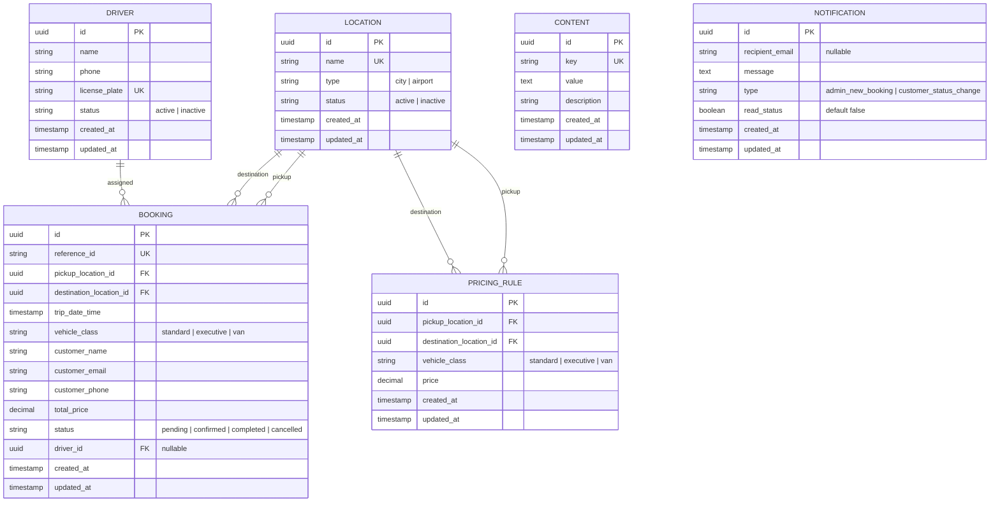

# Data Model: Airport Transfer and Driver Booking System

This document outlines the PostgreSQL database schema and relationships for Supabase, including Row-Level Security (RLS) policies.

## Entity Relationships (ERD Diagram)



---

## SQL Schema Definitions & RLS Policies

All tables are created in the `public` schema. Table IDs use UUIDs generated by the `gen_random_uuid()` function.

### 1. Locations Table (`locations`)
Stores active cities and airports.
```sql
CREATE TABLE public.locations (
  id UUID PRIMARY KEY DEFAULT gen_random_uuid(),
  name TEXT NOT NULL UNIQUE,
  type TEXT NOT NULL CHECK (type IN ('city', 'airport')),
  status TEXT NOT NULL DEFAULT 'active' CHECK (status IN ('active', 'inactive')),
  created_at TIMESTAMP WITH TIME ZONE DEFAULT timezone('utc'::text, now()) NOT NULL,
  updated_at TIMESTAMP WITH TIME ZONE DEFAULT timezone('utc'::text, now()) NOT NULL
);

-- RLS Policies
ALTER TABLE public.locations ENABLE ROW LEVEL SECURITY;

CREATE POLICY "Allow public read access to locations"
  ON public.locations FOR SELECT
  TO anon, authenticated
  USING (true);

CREATE POLICY "Allow admin full access to locations"
  ON public.locations FOR ALL
  TO authenticated
  USING (true)
  WITH CHECK (true);
```

### 2. Drivers Table (`drivers`)
Stores driver profiles. Driver information is sensitive and only visible to administrators.
```sql
CREATE TABLE public.drivers (
  id UUID PRIMARY KEY DEFAULT gen_random_uuid(),
  name TEXT NOT NULL,
  phone TEXT NOT NULL,
  license_plate TEXT NOT NULL UNIQUE,
  status TEXT NOT NULL DEFAULT 'active' CHECK (status IN ('active', 'inactive')),
  created_at TIMESTAMP WITH TIME ZONE DEFAULT timezone('utc'::text, now()) NOT NULL,
  updated_at TIMESTAMP WITH TIME ZONE DEFAULT timezone('utc'::text, now()) NOT NULL
);

-- RLS Policies
ALTER TABLE public.drivers ENABLE ROW LEVEL SECURITY;

CREATE POLICY "Allow admin full access to drivers"
  ON public.drivers FOR ALL
  TO authenticated
  USING (true)
  WITH CHECK (true);
```

### 3. Pricing Rules Table (`pricing_rules`)
Defines the route-based flat rate prices.
```sql
CREATE TABLE public.pricing_rules (
  id UUID PRIMARY KEY DEFAULT gen_random_uuid(),
  pickup_location_id UUID REFERENCES public.locations(id) ON DELETE CASCADE NOT NULL,
  destination_location_id UUID REFERENCES public.locations(id) ON DELETE CASCADE NOT NULL,
  vehicle_class TEXT NOT NULL CHECK (vehicle_class IN ('standard', 'executive', 'van')),
  price NUMERIC(10,2) NOT NULL CHECK (price >= 0),
  created_at TIMESTAMP WITH TIME ZONE DEFAULT timezone('utc'::text, now()) NOT NULL,
  updated_at TIMESTAMP WITH TIME ZONE DEFAULT timezone('utc'::text, now()) NOT NULL,
  CONSTRAINT pricing_rules_route_class_unique UNIQUE (pickup_location_id, destination_location_id, vehicle_class)
);

-- RLS Policies
ALTER TABLE public.pricing_rules ENABLE ROW LEVEL SECURITY;

CREATE POLICY "Allow public read access to pricing rules"
  ON public.pricing_rules FOR SELECT
  TO anon, authenticated
  USING (true);

CREATE POLICY "Allow admin full access to pricing rules"
  ON public.pricing_rules FOR ALL
  TO authenticated
  USING (true)
  WITH CHECK (true);
```

### 4. Bookings Table (`bookings`)
Manages ride bookings. Public users can submit booking requests, but only admins can query or modify them.
```sql
CREATE TABLE public.bookings (
  id UUID PRIMARY KEY DEFAULT gen_random_uuid(),
  reference_id TEXT NOT NULL UNIQUE,
  pickup_location_id UUID REFERENCES public.locations(id) ON DELETE RESTRICT NOT NULL,
  destination_location_id UUID REFERENCES public.locations(id) ON DELETE RESTRICT NOT NULL,
  trip_date_time TIMESTAMP WITH TIME ZONE NOT NULL,
  vehicle_class TEXT NOT NULL CHECK (vehicle_class IN ('standard', 'executive', 'van')),
  customer_name TEXT NOT NULL,
  customer_email TEXT NOT NULL,
  customer_phone TEXT NOT NULL,
  total_price NUMERIC(10,2) NOT NULL CHECK (total_price >= 0),
  status TEXT NOT NULL DEFAULT 'pending' CHECK (status IN ('pending', 'confirmed', 'completed', 'cancelled')),
  driver_id UUID REFERENCES public.drivers(id) ON DELETE SET NULL,
  created_at TIMESTAMP WITH TIME ZONE DEFAULT timezone('utc'::text, now()) NOT NULL,
  updated_at TIMESTAMP WITH TIME ZONE DEFAULT timezone('utc'::text, now()) NOT NULL
);

-- RLS Policies
ALTER TABLE public.bookings ENABLE ROW LEVEL SECURITY;

CREATE POLICY "Allow guests to insert booking requests"
  ON public.bookings FOR INSERT
  TO anon
  WITH CHECK (status = 'pending'); -- Guests can only create pending bookings

CREATE POLICY "Allow admin full access to bookings"
  ON public.bookings FOR ALL
  TO authenticated
  USING (true)
  WITH CHECK (true);
```

### 5. Content Table (`content`)
Dynamic content configurations for landing pages/FAQs.
```sql
CREATE TABLE public.content (
  id UUID PRIMARY KEY DEFAULT gen_random_uuid(),
  key TEXT NOT NULL UNIQUE,
  value TEXT NOT NULL,
  description TEXT,
  created_at TIMESTAMP WITH TIME ZONE DEFAULT timezone('utc'::text, now()) NOT NULL,
  updated_at TIMESTAMP WITH TIME ZONE DEFAULT timezone('utc'::text, now()) NOT NULL
);

-- RLS Policies
ALTER TABLE public.content ENABLE ROW LEVEL SECURITY;

CREATE POLICY "Allow public read access to content"
  ON public.content FOR SELECT
  TO anon, authenticated
  USING (true);

CREATE POLICY "Allow admin full access to content"
  ON public.content FOR ALL
  TO authenticated
  USING (true)
  WITH CHECK (true);
```

### 6. Notifications Table (`notifications`)
Stores notification history and dashboard logs for administrators.
```sql
CREATE TABLE public.notifications (
  id UUID PRIMARY KEY DEFAULT gen_random_uuid(),
  recipient_email TEXT,
  message TEXT NOT NULL,
  type TEXT NOT NULL CHECK (type IN ('admin_new_booking', 'customer_status_change')),
  read_status BOOLEAN DEFAULT false NOT NULL,
  created_at TIMESTAMP WITH TIME ZONE DEFAULT timezone('utc'::text, now()) NOT NULL,
  updated_at TIMESTAMP WITH TIME ZONE DEFAULT timezone('utc'::text, now()) NOT NULL
);

-- RLS Policies
ALTER TABLE public.notifications ENABLE ROW LEVEL SECURITY;

CREATE POLICY "Allow admin full access to notifications"
  ON public.notifications FOR ALL
  TO authenticated
  USING (true)
  WITH CHECK (true);
```

---

## Validation & Business Rules

1. **Uniqueness**:
   - Locations must have unique names.
   - Drivers must have unique license plates.
   - Pricing Rules must have a unique combination of `pickup_location_id`, `destination_location_id`, and `vehicle_class`.
2. **Date Validation**:
   - `trip_date_time` must be in the future during Booking creation. Checked via validation schemas before database insert.
3. **Status Transitions**:
   - Bookings start as `pending`.
   - Admin can transition `pending` -> `confirmed` or `cancelled`.
   - Admin can transition `confirmed` -> `completed` or `cancelled`.
4. **Driver Assignment**:
   - Drivers can only be assigned to bookings if their status is `active`.
   - Prior to assignment, the system checks for overlapping booking schedules for the driver (same driver assigned to another booking within a 3-hour window). This check is performed inside the server-side action database transaction.
